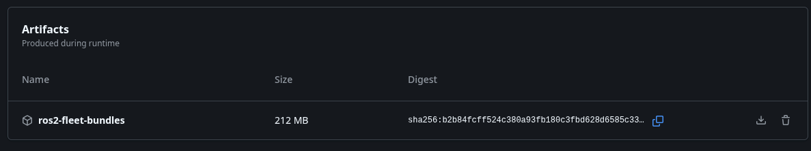

# ROS2 Bundle with Nix

This repo contains an oversimplified workspace with:
- A talker/listener package
- A custom interfaces package
- A bringup package

We will use Nix to build this workspace with Jazzy, and bundle the result as a standalone executable. I've added Zenoh as default RMW in the mix as extra complexity because why not.

I highly recommend this introductory read [ROS 2 with Nix](https://sgvd.ai/post/2026-03-25-ros2-with-nix/), because I assume you already have Nix installed in your machine.

> [!TIP]
> Also make sure `trusted-users = root <YOUR_USERNAME> ` is in `/etc/nix/nix.conf` or you won't be able to pull cached ROS2 packages from [cachix](https://app.cachix.org/cache/ros), unless you fancy compiling everything from scratch.

The [flake](./flake.nix) is commented to help you follow along, it defines:
- **default dev shell**: a hermetic terminal environment with all ROS 2 build tools and dependencies.
- **ros2-workspace**: the pre-compiled, raw ROS 2 environment.
- **ros2-bundle**: a portable, self-extracting executable wrapper to bring up the whole stack.

Mandatory thanks to [lopsided98/nix-ros-overlay](https://github.com/lopsided98/nix-ros-overlay), which is the project that actually provides everything required to make ROS 2 work flawlessly with Nix. The maintainers deserve all the praise for making this possible.

## Local Development

Enter the Jazzy development shell
```bash
nix develop
echo $RMW_IMPLEMENTATION
colcon build --base-paths src # this will build in your LOCAL WORKSPACE != Nix
```

Spin the zenoh router daemon:
```bash
ros2 run rmw_zenoh_cpp rmw_zenohd
```

Run your awesome ros nodes:
```bash
source install/setup.bash
ros2 run my_awesome_package talker
ros2 run my_awesome_package listener
```

> [!NOTE]
> **You don't have to follow the next steps to bundle your ROS project**, feel free to skip to [the next part](#deploying-the-standalone-to-a-robot), just follow along if you are curious to dive deeper into managing the compiled workspace as a nix package.

Nix can also build the whole ros project as a Nix Package!
```bash
nix build # defaults to ros2-bundle
ls result # it will create a result directory that symlinks to the `nix/store`
./result/bin/ros2-bundle # you can actually run this and will launch the bringup
```

Indeed that same executable is what is run with:
```bash
nix run .#ros2-bundle
```

You can also just build the packaged workspace and run the commands manually, if this works better for your workflow
```bash
nix build .#ros2-workspace
./result/bin/ros2 run rmw_zenoh_cpp rmw_zenohd
./result/bin/ros2 run my_awesome_package talker
```

> [!WARNING]
> Now don't try just copying this on your robot just yet! The result has the dependencies linked to the `/nix/store`!

If your robot actually does have Nix installed, we can sync the packaged workspace and all its dependencies securely over SSH:
```bash
nix copy .#ros2-bundle --to ssh://nuc@192.168.1.X
```

> [!TIP]
> Why would you care about this in the first place? This is your gateway to instantaneous rollbacks, as any content change in `#ros2-bundle` creates a new unique hash in the nix store that you can track!

But let's not get sidetracked...

## Deploying the standalone to a robot

> [!IMPORTANT]
> the example flake does not include cross-compilation, so the resulting binary will only work with the same architecture as host machine! I will expand on that in another tutorial.

So, your robot's stack is bulletproof and you want to deploy it as a standalone executable because you don't want Nix (or ROS, or Docker) installed on your robot. Nix still has your back!

Compile a self-contained bundle on your workstation:
```Bash
nix bundle .#ros2-bundle
```

This will create a [-arx]The resulting bundle `./ros2-bundle-arx` can be run **standalone**.

Copy it to your robot and run it:
```bash
scp ros2-bundle-arx robot_user@192.168.1.100:~/
ssh robot_user@192.168.1.100
./ros2-bundle-arx # you may need sudo depending on AppArmor (e.g. ubuntu 24.04)
```

One important detail: While the bundle contains all the software, it still executes using the host kernel's hardware layer. If your bringup needs to talk to a LiDAR via `/dev/ttyUSB0` ensure that the robot's OS is setup correctly.

## One more thing!

You don't have to bundle this yourself, the CI can do it for you via [GH Actions](.github/workflows/build.yml)! Check out the Action artifacts!

<figure>
  
  <figcaption>GH Action artifacts</figcaption>
</figure>

It's ultra fast thanks to the [cachix](https://app.cachix.org/cache/ros) cache!
